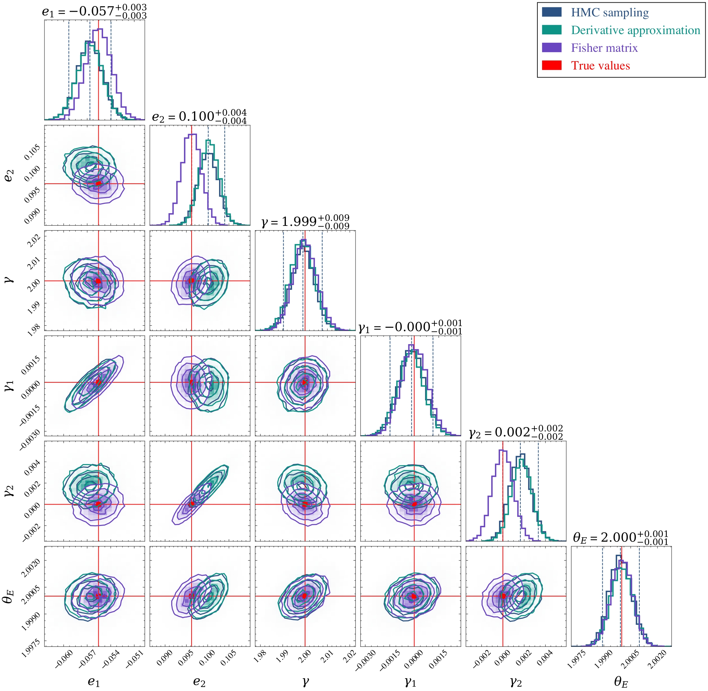

# Lens Reconstruction - Parametric Lens Reconstruction for Strongly Lensed EM+GW Systems

This repository contains code for parametric lens reconstruction of strongly lensed electromagnetic (EM) and gravitational wave (GW) systems, including Bayesian parameter estimation using Hamiltonian Monte Carlo (HMC), likelihood derivative approximations, and Fisher matrix analysis.

## Main Package: GWEMFISH

The **GWEMFISH** package (`gwemfish/`) contains the finalized scripts for parametric lens reconstruction of strongly lensed electromagnetic (EM) and gravitational wave (GW) systems.

GWEMFISH provides:
- **Bayesian Parameter Estimation**: Posterior inference using Hamiltonian Monte Carlo (HMC) with NUTS sampler
- **Likelihood Derivative Approximations**: Computation of gradients and Hessians (and higher order matrices if needed) for approximate posterior estimation
- **Fisher Matrix Analysis**: Approximate posterior estimation using Fisher information matrix

See [`gwemfish/README.md`](gwemfish/README.md) for package documentation and usage.

## Directory Structure

```
lens_reconstruction/
├── gwemfish/                    # Main package (GWEMFISH)
│   ├── README.md               # Package documentation
│   ├── __init__.py
│   ├── config.py
│   ├── data_sim.py
│   ├── fisher.py
│   ├── inference.py
│   ├── jax_config.py
│   ├── jaxcosmo.py
│   ├── lens_setup.py
│   ├── lensimage_gw.py
│   ├── prob_model.py
│   └── corner_plot_utils.py
│
├── examples/                    # User-facing examples
│   ├── notebooks/              # Example notebooks
│   │   └── example_notebook.ipynb
│   └── scripts/                # Example scripts
│       └── example_usage.py
│
├── notebooks/                   # Development notebooks (work-in-progress)
│   ├── README.md               # See this for development notebook info
│   ├── EM_GW_PE_MCMC_HMC.ipynb
│   └── EM_GW_PE_MCMC_HMC_copy.ipynb
│
├── scripts/                     # Standalone utilities
│   ├── lensimage_gw.py
│   ├── jaxcosmo.py
│   ├── fisher.py
│   └── corner_plot_utils.py
│
├── data/                        # Output data (samples, truths)
│   ├── samples_PE_EM.pkl
│   ├── samples_PE_EM_GW.pkl
│   ├── samples_fisher_EM_GW.pkl
│   └── truths_PE_EM_GW.pkl
│
└── plots/                       # Generated plots
    └── [corner plots and figures]
```

## ⚠️ Important Setup Requirement

**REQUIRED**: The `herculens` package requires a source code modification for JAX compatibility. See the [Installation](#installation) section below for detailed instructions.

## Quick Start

> **⚠️ Work in Progress**: This package is currently under active development and is not yet ready for general use. The API may change and features may be incomplete.

### Examples

- **Jupyter Notebook**: See `examples/notebooks/example_notebook.ipynb`
- **Python Script**: See `examples/scripts/example_usage.py`

### Development Notebooks

Development notebooks in `notebooks/` are work-in-progress and not intended for distribution. See [`notebooks/README.md`](notebooks/README.md) for details.

## Dependencies

This project uses [`uv`](https://github.com/astral-sh/uv) for dependency management. All dependencies are specified in `pyproject.toml` and locked in `uv.lock`.

Key dependencies:
- `jax` / `jaxlib` - Numerical computing
- `numpyro` - Probabilistic programming framework
- `herculens` - Gravitational lensing library (⚠️ requires source code modification - see Installation)
- `jaxtronomy` - JAX-based astronomy tools
- `matplotlib` - Plotting library
- `corner` - Corner plot visualization
- `numpy`, `scipy` - Scientific computing

See `pyproject.toml` for the complete list of dependencies.

## Installation

### Using `uv` (Recommended)

This project uses [`uv`](https://github.com/astral-sh/uv) for fast and reliable dependency management.

```bash
# Install uv if you haven't already
curl -LsSf https://astral.sh/uv/install.sh | sh

# Navigate to project directory
cd /path/to/lens_reconstruction

# Sync dependencies (installs all packages from pyproject.toml)
uv sync

# Activate the virtual environment
source .venv/bin/activate  # On macOS/Linux
# or
.venv\Scripts\activate  # On Windows
```

**Note**: Package installation (`gwemfish`) is coming soon and currently under development. For now, add the project root to your Python path in your scripts/notebooks (see examples for reference).

**Syncing dependencies**: Run `uv sync` whenever dependencies change or after pulling updates. This ensures your environment matches the `uv.lock` file.

### ⚠️ Required Source Code Modification

**IMPORTANT**: The `herculens` package requires a source code modification for JAX compatibility:

1. Locate the herculens installation in your virtual environment:
   ```bash
   # Find the path (usually in .venv/lib/python3.13/site-packages/herculens/)
   python -c "import herculens; print(herculens.__file__)"
   ```

2. Edit the file: `herculens/MassModel/mass_model.py` at **line 125**

3. Change:
   ```python
   potential = np.zeros_like(x)
   ```
   to:
   ```python
   potential = jnp.zeros_like(x)
   ```

4. Make sure to import JAX at the top of the file if not already present:
   ```python
   import jax.numpy as jnp
   ```

After modifying the source code, you may need to restart your Python kernel or reload the module.

## Features

- **Parametric Lens Reconstruction**: Joint modeling of lens mass, source light, and lens light profiles
- **Joint EM+GW Parameter Estimation**: Bayesian inference combining lensed galaxy images and gravitational wave time delays
- **Hamiltonian Monte Carlo**: NUTS (No-U-Turn Sampler) for efficient posterior sampling
- **Likelihood Derivatives**: Automatic computation of gradients and Hessians for optimization
- **Fisher Matrix Analysis**: Fast approximate posterior estimation using Fisher information matrix
- **Flexible Lens Models**: Support for various lens mass models (EPL, SHEAR, etc.)
- **Source Plane Inference**: Option to sample source positions and solve for images

## Documentation

- **Package Documentation**: [`gwemfish/README.md`](gwemfish/README.md)
- **Development Notebooks**: [`notebooks/README.md`](notebooks/README.md)
- **Examples**: See `examples/` directory

## Output

- **Data**: Saved samples and truths are stored in `data/`
- **Plots**: Generated corner plots and figures are saved to `plots/`
  - Comparison of different parameter estimation methods: derivative approximation, Fisher matrix, and HMC (see `plots/` directory for all comparison plots)
  
  <!-- -->
   

